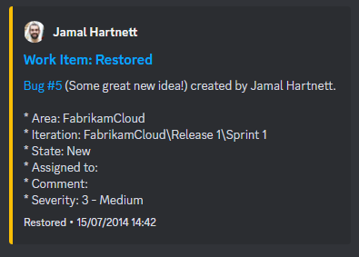

# Az-Devops-Notification-Discord
Integrate Azure Devops notifications in Discord



Triggers Working:
- [x] Work Items
- [ ] Build
- [ ] Code Push
- [ ] Pull Request
- [ ] Release
- [ ] Run Job
- [ ] Run Stage

# Start Application

1. Run Application:

```
python3 main.py
```

2. Run Ngrok:

```
ngrok http 5000
```

# Configuration Discord
1. Open Channel Settings:


2. Select Tab Integration > Webhooks:


3. New webhook

4. Select Webhook > rename and copy url:


# Configuration Azure Devops

1. Open Project Settings in Azure Devops > Service Hooks:

2. Create Subscription and select Web Hooks:


3. Select Trigger type:


4. Set URL for Ngrok

5. In HTTP headers set discord-id and discord-token, for webhook generate in discord channel:

Example: 
- https://discord.com/api/webhooks/{{discord-id}}/{{discord-token}}
- https://discord.com/api/webhooks/0000000000000000000/sdkljasnjlkqejiko3rqjopiQPJI09321489jilkfjlkjiqjp314ipme8OSKLR7yGCW7A


```
discord-id: 0000000000000000000
discord-token: sdkljasnjlkqejiko3rqjopiQPJI09321489jilkfjlkjiqjp314ipme8OSKLR7yGCW7A
```

6. Set Resource Version Latest:


7. Test and Finish:


